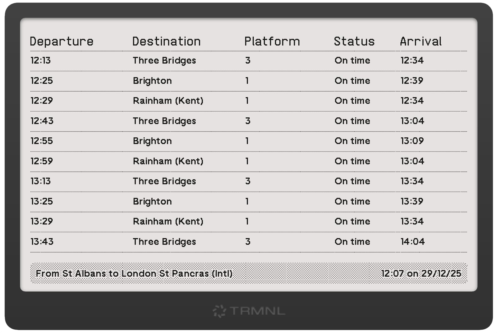

# TRMNL National Rail Departures

A [TRMNL](https://usetrmnl.com) extension to display National Rail departures from a specified station to a target station.



## Prerequisites

You'll need:

* An API key for the National Rail Darwin API, [which you can get here](http://realtime.nationalrail.co.uk/OpenLDBWSRegistration/).
* The CRS codes for the departure and destination stations, which you can find on [the National Rail website](https://www.nationalrail.co.uk/). e.g. St Pancras is STP; St Albans City is SAC; and so on.
* You may optional set a threshold for fast trains in the settings. If set, this will flag services to the target station with a duration below that length of time.

## Running Locally

You'll need Ruby to run [trmnl-preview](https://github.com/usetrmnl/trmnlp) or Docker.

```bash
NATIONAL_RAIL_API_KEY=<your-api-key-here> bin/trmnlp serve
```

## Attributions

The data feed is [powered by National Rail Enquiries](https://www.nationalrail.co.uk/developers/).

The icon used in the plugin catalogue is [from the Material Design icons](https://github.com/Templarian/MaterialDesign/blob/master/LICENSE).
